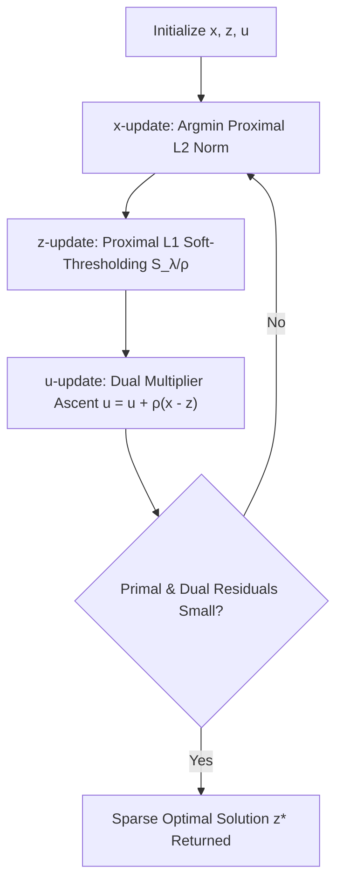

# ADMM Distributed Consensus Optimization Skill

Alternating Direction Method of Multipliers (ADMM) solver decomposing composite convex optimization into distributed subproblems.

## Features
- **100% Python Standard Library**: No external BLAS or solvers.
- **Proximal Soft-Thresholding**: Generates true exact zeros for feature selection.
- **Consensus Optimization Ready**: Direct scalability to federated agent learning.
